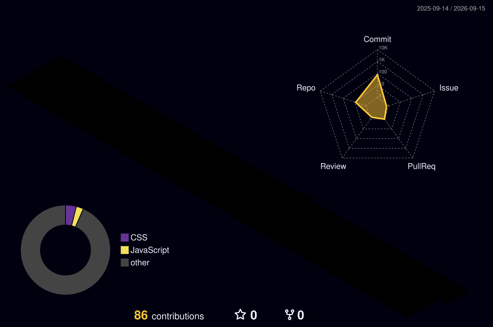

<!-- ==================== HEADER ==================== -->

<div align="center">


<br/>


</div>

---

## 🌸 About Me

```yaml
name: Smitika Priyadarshini Das
role: Aspiring Data Analyst

skills:
  - Power BI
  - Tableau
  - Excel
  - Python
  - SQL

currently: Learning, Building & Exploring 🚀
```

---

## ⚡ Tech Stack
<br/>

<div align="center">

### 👨‍💻 Languages
<br/>
<table align="center">
    <tr>
        <td align="center" width="90">
            
            <br>Python
        </td>
        <td align="center" width="90">
            
            <br>JavaScript
        </td>
        <td align="center" width="90">
            
            <br>Java
        </td>
        <td align="center" width="90">
            
            <br>C
        </td>
        <td align="center" width="90">
            
            <br>HTML5
        </td>
        <td align="center" width="90">
            
            <br>CSS
        </td>
    </tr>
</table>

### 🧠 AI / ML
<br/>
<table align="center">
    <tr>
        <td align="center" width="90">
            
            <br>Scikit-Learn
        </td>
        <td align="center" width="90">
            
            <br>NumPy
        </td>
        <td align="center" width="90">
            
            <br>Pandas
        </td>
        <td align="center" width="90">
            
            <br>Matplotlib
        </td>
    </tr>
</table>

### 🌐 Web Frameworks & Libraries
<br/>
<table align="center">
    <tr>
        <td align="center" width="90">
            
            <br>React
        </td>
        <td align="center" width="90">
            
            <br>Next JS
        </td>
        <td align="center" width="90">
            
            <br>NodeJS
        </td>
        <td align="center" width="90">
            
            <br>Vite
        </td>
        <td align="center" width="90">
            
            <br>jQuery
        </td>
    </tr>
    <tr>
        
    </tr>
</table>

### 🗄️ Databases
<br/>
<table align="center">
    <tr>
        <td align="center" width="90">
            
            <br>MySQL
        </td>
        <td align="center" width="90">
            
            <br>MongoDB
        </td>
        <td align="center" width="90">
            
            <br>SQLite
        </td>
        <td align="center" width="90">
            
            <br>FastAPI
        </td>
    </tr>
</table>

### ☁️ Cloud & DevOps
<br/>
<table align="center">
    <tr>
        <td align="center" width="90">
            
            <br>AWS
        </td>
        <td align="center" width="90">
            
            <br>Vercel
        </td>
        <td align="center" width="90">
            
            <br>Netlify
        </td>
    </tr>
</table>

### ⚙️ Tools & Platforms
<br/>
<table align="center">
    <tr>
        <td align="center" width="90">
            
            <br>Git
        </td>
        <td align="center" width="90">
            
            <br>GitHub
        </td>
        <td align="center" width="90">
            
            <br>Vscode
        </td>
        <td align="center" width="90">
            
            <br>Figma
        </td>
        <td align="center" width="90">
            
            <br>Canva
        </td>
    </tr>
</table>
</div>

---

## 📊 GitHub Stats

<div align="center">


<br/><br/>

</div>

## 🚀 Featured Projects

<div align="center">

<a href="https://github.com/smitika2006">

</a>

<a href="https://github.com/smitika2006/Zomato_PowerBI_Dashboard">

</a>

<br/>

<a href="https://github.com/smitika2006/HR_Analytics_Dashboard">

</a>

<a href="https://github.com/smitika2006/pubg_tableau_dashboard">

</a>

</div>

---

## 🌱 Currently Exploring

<div align="center">


</div>

---


## 🧊 3D Contribution Graph

<div align="center">



</div>

---

## 🎮 Pac-Man Contribution Animation

<div align="center">


</div>

---

## 🌈 Let's Connect

<div align="center">

<a href="https://www.linkedin.com/in/smitika-priyadarshini-das-03a223366/">

</a>

<a href="https://github.com/smitika2006">

</a>
<br>
</br>


<br/><br/>


</div>

