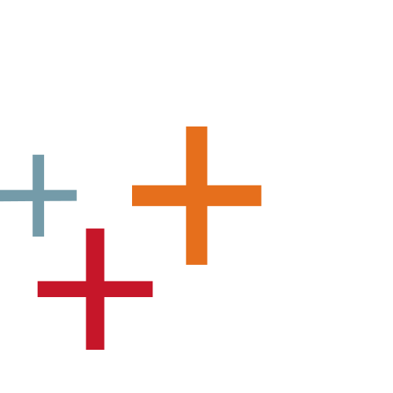

  
   
  

---
 

  

---

## ⚡ TECH STACK

### LANGUAGES // CORE

<table align="center">
<tr><td align="center" width="100">

 Python
</td><td align="center" width="100">

 JavaScript
</td><td align="center" width="100">

 TypeScript
</td><td align="center" width="100">

 Java
</td><td align="center" width="100">

 C
</td>

<td align="center" width="100">

 HTML
</td>

<td align="center" width="100">

 CSS
</td></tr>
</table>
 

### AI / ML // DATA

<table align="center">
<tr><td align="center" width="100">

 Python
</td><td align="center" width="100">

 NumPy
</td><td align="center" width="100">

 Pandas
</td><td align="center" width="100">

 Scikit-Learn
</td><td align="center" width="100">

 Matplotlib
</td><td align="center" width="100">

 Power BI
</td>

<td align="center" width="100">

 Tableau
</td></tr>
</table> 

### WEB // FRAMEWORKS

<table align="center">
<tr><td align="center" width="100">

 React
</td><td align="center" width="100">

 Next.js
</td>

<td align="center" width="100">

 Node.js
</td><td align="center" width="100">

 FastAPI
</td><td align="center" width="100">

 Vite
</td></tr>
</table> 

### DATABASE // BACKEND

<table align="center">
<tr><td align="center" width="100">

 MySQL
</td><td align="center" width="100">

 MongoDB
</td>

<td align="center" width="100">

 Supabase
</td><td align="center" width="100">

 SQLite
</td><td align="center" width="100">

 SQL
</td></tr>
</table> 

### CLOUD // DEPLOYMENT

<table align="center">
<tr><td align="center" width="100">

 AWS
</td><td align="center" width="100">

 Vercel
</td><td align="center" width="100">

 Netlify
</td></tr>
</table> 

### TOOLS // WORKFLOW

<table align="center">
<tr><td align="center" width="100">

 Git
</td><td align="center" width="100">

 GitHub
</td>

<td align="center" width="100">

 VS Code
</td><td align="center" width="100">

 Figma
</td><td align="center" width="100">

 Canva
</td></tr>
</table>

---
## 📊 GITHUB STATS

  

## 🚀 FEATURED PROJECTS

 

---

## 🌱 CURRENTLY EXPLORING

---

## 🧊 3D CONTRIBUTION GRAPH

---

## 🎮 PAC-MAN CONTRIBUTION ANIMATION

---

## 🌈 LET'S CONNECT

 
 

  

  

